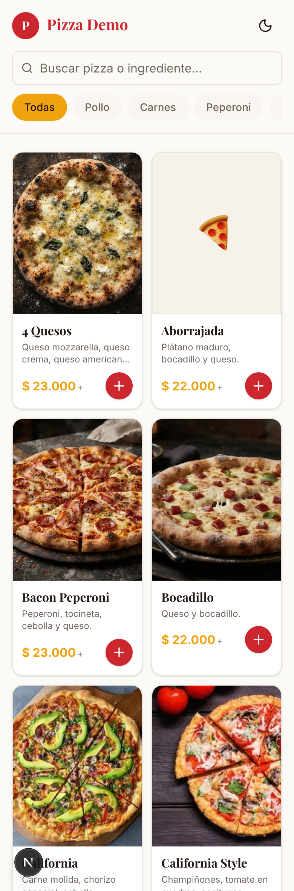
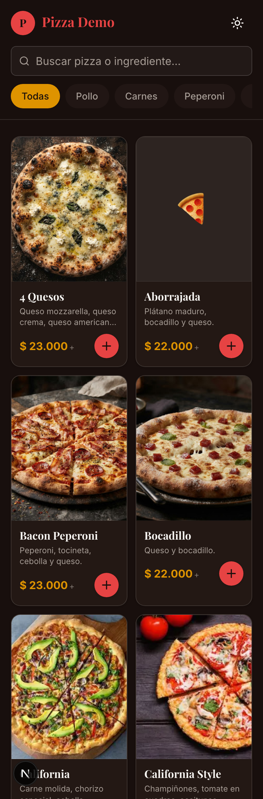
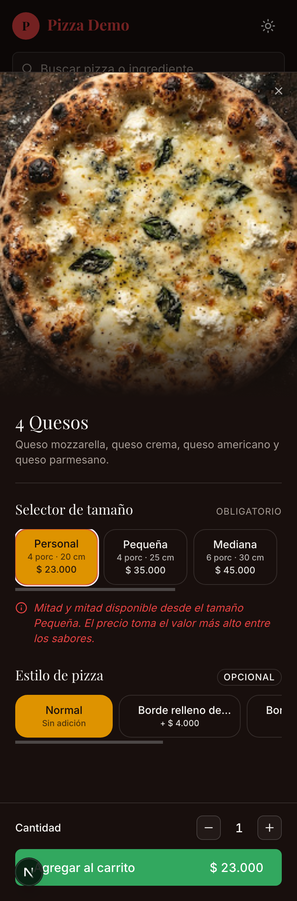

# Pizza Demo — Operational SaaS for Pizzerias

> Full-stack ordering & operations system for a WhatsApp-first pizzeria:
> web catalog → structured order → real-time staff panel → delivery drivers.
> Built as a functional MVP.

**Stack:** Next.js 16 · React 19 · TypeScript · Supabase · Tailwind v4 · Vercel

---

## Overview

Small pizzerias in Colombia sell almost entirely through WhatsApp — which means
lost orders in the chat, constant *"is it on its way?"* messages, and re-typing
every order by hand to invoice it. **Pizza Demo** adds a thin operational layer
behind WhatsApp: customers order through a structured web catalog, staff run
everything from a real-time panel, and status updates are pushed back to the
customer automatically.

## Key Features

- 🍕 **Web catalog with a pizza builder** — size, half-and-half flavors, crust
  add-ons (configurable products a plain WhatsApp catalog can't handle)
- 🧾 **One-step checkout** — structured Colombian address + payment method +
  proof upload
- 📊 **Real-time staff panel** (Supabase Realtime) with an audible new-order
  alert (Web Audio API)
- 🛵 **Driver view** with actionable orders + Google Maps
- 💬 **Automatic WhatsApp notifications** on every status change
- ⏰ **Proactive delay alerts** (pg_cron) before the customer has to ask
- 🌗 **Light/dark theme**, mobile-first

## Tech Stack

`Next.js 16 (App Router · RSC · Server Actions)` · `React 19` · `TypeScript` ·
`Supabase (Postgres · Auth · Realtime · Storage · RLS · pg_cron)` ·
`Tailwind CSS v4` · `shadcn/ui` · `Zod` · `React Hook Form` · `Vitest`

## Technical Highlights

- **WhatsApp Cloud API** integration with HMAC-SHA256 webhook verification +
  automatic payment-proof detection from incoming images
- **Order state machine** (delivery vs. pickup) covered by unit tests
- **Row-Level Security**: 47 policies across 12 tables for a 4-role system
  (admin / cashier / kitchen / driver)
- **Server Actions** with Zod validation at the boundaries only
- **Realtime subscriptions** with auth-token sync for long shifts
- **FOUC-free dark mode** (blocking init script + hydration-safe toggle)
- **Feature-based architecture** (queries / actions / schemas / types / tests
  per domain)

## Scale

~14,500 lines of TS/TSX · 53 components · 12 tables · 10 SQL migrations ·
8 Server Actions · 8 test files

## Screenshots

| Catalog — light | Catalog — dark |
|---|---|
|  |  |

**Pizza builder** — size · half-and-half flavors · crust style, priced live:

## Scope & Honest Notes (v1)

Single-tenant, fixed ETA per zone, manual payment validation (no payment
gateway). Deliberately **out of scope for v1**: analytics dashboard, PWA,
GPS tracking, AI parsing, multi-tenant. Documented roadmap for v2.

## Author

**Rafael Santos** — Full-stack developer · *codecraftdev*
[GitHub](https://github.com/rafaelSantos43) · [LinkedIn](#) · backend@codecraftdev.com
